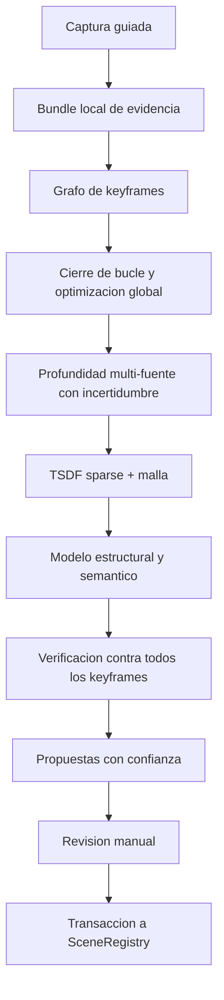

# Scanner V3 "Atlas" - reconstruccion global verificable

Estado: propuesta de arquitectura  
Rama: `addScannerV3`  
Fecha: 12 de agosto de 2026

## Vision

Scanner V3 deja de intentar decidir la habitacion mientras el usuario la recorre.
Durante la captura conserva evidencia de calidad; al finalizar optimiza globalmente
todas las vistas y recien entonces propone geometria editable.

El objetivo no es producir la malla mas vistosa sino la representacion estructural
mas confiable para gameplay: paredes, piso, techo, aberturas y obstaculos con escala
metrica, incertidumbre y evidencia rastreable.

Restricciones heredadas:

- local y sin backend;
- gratuito y redistribuible;
- iPhone sin LiDAR y Android como baseline;
- sensores de profundidad son aceleradores opcionales;
- convive con escaneo manual, AutoScan y Scanner V2;
- materializa exclusivamente objetos actuales de `SceneRegistry`;
- nunca modifica contenido manual sin confirmacion.

## Idea central

V3 mantiene dos mundos separados:

1. **Modelo de evidencia:** keyframes, poses, intrinsecos, profundidad, matches,
   incertidumbre y observaciones semanticas. Es temporal y auditable.
2. **Modelo de producto:** `WallObject`, `CubeObject`, `FloorPoint`, `DoorData` y
   `MarkerObject`. Solo cambia mediante una transaccion confirmada.

## 1. Captura guiada por informacion

### Bundle V3

Cada keyframe conserva temporalmente:

- imagen RGB reducida y una miniatura;
- pose AR y covariance/calidad disponible;
- intrinsecos, orientacion y timestamp;
- mapa de profundidad nativo si existe;
- profundidad monocular y confianza, generadas despues;
- tracking state, exposicion, blur y movimiento;
- puntos/raycasts metricos y plano AR asociado;
- transform relativo a `WorldOrigin` y version de calibracion.

El bundle se escribe incrementalmente en almacenamiento local para sobrevivir a una
pausa o cierre inesperado. Se elimina al aceptar/cancelar, salvo que QA habilite su
exportacion explicita.

### Seleccion activa

Un keyframe se acepta por ganancia de informacion, no solo por tiempo:

- baseline suficiente respecto de vistas previas;
- nitidez y exposicion aceptables;
- tracking estable;
- nueva cobertura o reduccion de incertidumbre;
- solapamiento entre 40% y 80%;
- limite de redundancia por zona y direccion.

La UI muestra un mapa polar/espacial de cobertura y pide acciones concretas:
"alejate de esta pared", "mira esta esquina lateralmente", "falta la zona baja".

## 2. Grafo de poses con cierre de bucle

Cada keyframe es un nodo SE(3). Aristas:

- odometria relativa de ARKit/ARCore;
- correspondencias visuales verificadas geometricamente;
- reobservacion de la imagen de referencia;
- profundidad/raycasts metricos;
- planos persistentes y puntos de ancla;
- cierres de bucle al volver a una zona conocida.

Pipeline propuesto:

1. descriptor global pequeno para candidatos de loop closure;
2. ORB/AKAZE o matcher local pequeno para correspondencias;
3. matriz esencial/PnP + RANSAC para rechazar falsos loops;
4. optimizacion robusta del grafo con perdida Huber/Cauchy;
5. bundle adjustment local y global solo cuando mejora el residuo;
6. conservar pose AR original si la optimizacion diverge.

La imagen fisica de referencia actua como prior metrico y de heading, no como un
simple origen inicial.

## 3. Profundidad multi-fuente probabilistica

Cada fuente produce profundidad, varianza y mascara valida:

- ARCore Depth / ARKit scene depth cuando exista;
- triangulacion multivista usando poses optimizadas;
- profundidad monocular metric/relative local;
- raycasts de planos y feature points;
- intersecciones estructurales ya confirmadas.

La fusion es por precision inversa. Una prediccion neural nunca reemplaza una medida
metrica de mayor confianza. Escala y shift del modelo monocular se ajustan por frame
contra las muestras metricas y se descarta el frame si el residuo excede el gate.

### Runtime neural

Baseline: Unity Sentis para modelos ONNX soportados. Si el perfil demuestra que
Sentis no aprovecha bien el hardware, evaluar un plugin nativo ExecuTorch:

- Core ML/MPS en iOS;
- Vulkan/QNN/XNNPACK en Android;
- modelos y artefactos separados por backend.

Modelo inicial candidato: Depth Anything V2 Small metric indoor, sujeto a conversion,
benchmark y auditoria de licencia del checkpoint exacto.

## 4. Reconstruccion densa

### TSDF sparse con voxel hashing

- bloques activados solo alrededor de superficies observadas;
- espacio libre integrado para suprimir paredes fantasma;
- peso dependiente de angulo, distancia, blur y varianza de profundidad;
- reintegracion de keyframes cuando cambia el grafo de poses;
- presupuesto duro de memoria y LRU de bloques;
- marching cubes al terminar o por regiones en background.

Los surfels V2 siguen disponibles como fallback si TSDF no entra en el presupuesto.

### Apariencia auxiliar

Gaussian Splatting/NeRF no define colisiones ni paredes. Puede usarse como vista
fotorealista de QA para descubrir huecos, pero nunca como verdad geométrica del juego.

## 5. Optimizacion estructural

Sobre la malla/point cloud:

1. planos robustos con RANSAC y refinamiento ponderado;
2. direcciones dominantes Manhattan/Atlanta sin forzar habitaciones irregulares;
3. grafo de intersecciones piso-pared-techo;
4. cierre de esquinas y loops de habitacion;
5. pairing de caras paralelas para grosor de pared;
6. aberturas como ausencia persistente de superficie, no solo clasificacion visual;
7. cajas orientadas/convex hulls para obstaculos y muebles;
8. optimizacion conjunta con restricciones blandas y residuo observable.

Cada entidad contiene internamente:

- confianza global;
- keyframes que la soportan;
- error metrico esperado;
- zonas extrapoladas;
- motivo de rechazo o necesidad de revision.

## 6. Semantica temporal

Un modelo pequeno detecta puerta, ventana, mueble y zona dinamica. Las detecciones
solo se aceptan si persisten en varias vistas y son coherentes con la geometria.

Personas, mascotas, pantallas y objetos que se mueven se enmascaran antes de fusionar.
Una puerta requiere evidencia visual mas una abertura geometrica; de lo contrario se
crea una sugerencia, no un `DoorData` definitivo.

## 7. Verificacion por render inverso

Antes de mostrar propuestas, V3 renderiza el modelo reconstruido desde cada pose y
lo compara con la evidencia:

- error de profundidad;
- siluetas y bordes;
- cobertura visible esperada;
- superficie predicha sin soporte;
- consistencia de escala y reproyeccion.

Una pared que se ve correcta desde arriba pero contradice keyframes vuelve a estado
incierto. Esta etapa evita geometria visualmente plausible pero falsa.

## 8. Revision y materializacion transaccional

La UI presenta un modelo fantasma por capas:

- verde: evidencia alta;
- amarillo: extrapolacion/revision;
- rojo: conflicto;
- gris: region no observada.

El usuario puede aceptar todo, aceptar por entidad, corregir handles o pedir un nuevo
recorrido localizado. Al confirmar:

1. se toma snapshot de `SceneRegistry`;
2. se deduplica contra objetos manuales;
3. se materializan objetos normales;
4. se valida malla, collider y serializacion;
5. ante cualquier error se revierte toda la transaccion.

## 9. Perfiles de ejecucion

### Mobile baseline

- captura y optimizacion completamente en el telefono;
- modelos pequenos cuantizados;
- procesamiento post-captura con progreso y cancelacion;
- calidad adaptada a memoria/temperatura.

### Mobile high-end

- depth nativo, NPU/GPU, TSDF mas fino y semantica completa.

### Laboratorio local opcional

- exportacion manual del bundle a una PC del equipo;
- VGGT/MASt3R-SLAM/COLMAP solo como oraculos comparativos y generadores de ground truth;
- nunca requerido por el usuario final y nunca conectado a cloud.

## 10. Seguridad y privacidad

- ninguna API de red en el pipeline V3;
- imagenes crudas fuera de `ScanData`;
- bundle con expiracion y borrado explicito;
- exportacion QA opt-in;
- modelos empaquetados y hash verificado;
- modo de test que falla si observa conexiones salientes durante captura/proceso.

## Decisiones de tecnologia

| Tecnologia | Uso | Decision |
|---|---|---|
| AR Foundation | poses, intrinsecos, depth/raycast | Base obligatoria |
| OpenCV | features, RANSAC, PnP, triangulacion | Candidato permisivo |
| Sentis | inferencia integrada en Unity | Primer runtime neural |
| ExecuTorch | aceleracion nativa avanzada | Spike posterior |
| Depth Anything V2 Small | prior de profundidad | Candidato, no verdad metrica |
| VGGT | oraculo offline de laboratorio | No shipping baseline |
| MASt3R-SLAM/DUSt3R | investigacion comparativa | No shipping por licencia/GPU |
| RoomPlan | referencia de calidad LiDAR | No baseline: exige LiDAR |
| Gaussian Splatting | inspeccion visual | Nunca colision/geometria final |

## Referencias tecnicas evaluadas

- VGGT, CVPR 2025: https://github.com/facebookresearch/vggt
- MASt3R-SLAM, CVPR 2025: https://github.com/rmurai0610/MASt3R-SLAM
- DUSt3R y licencia de checkpoints: https://github.com/naver/dust3r
- Depth Anything V2: https://github.com/DepthAnything/Depth-Anything-V2
- ExecuTorch mobile: https://docs.pytorch.org/executorch/stable/getting-started.html
- OpenCV calib3d: https://github.com/opencv/opencv/tree/4.x/modules/calib3d
- Apple RoomPlan: https://developer.apple.com/documentation/roomplan

Las licencias deben auditarse sobre la version y el checkpoint exactos antes de
incorporar cualquier dependencia. Una licencia permisiva del codigo no garantiza que
los pesos, datasets de entrenamiento o subdependencias tengan el mismo permiso.
